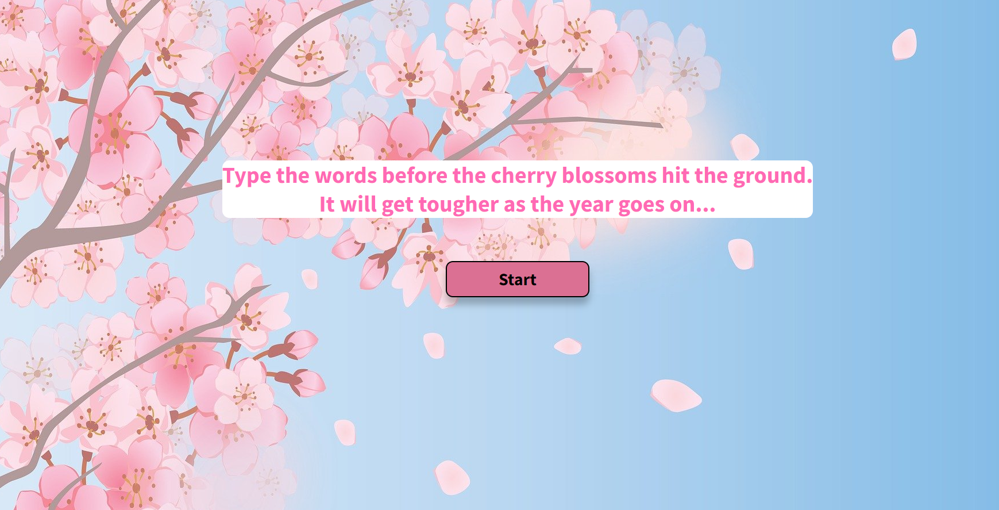

# Seasons Game

### A speed typing game with a seasonal theme. Built using HTML, SCSS and Javascript.

#### Project Link [_here_](https://aimeejenner.github.io/seasons-game/).

<p align="center">
  
</p>

## Description

This game challenges the player to type in given words before falling objects hit the bottom of the screen. Players progress through four levels - Spring (falling blossoms), Summer (falling raindrops), Autumn (falling leaves) and Winter (falling snowflakes). The objects fall at a faster rate as the game goes on.


## User Story

-   **As a player I would like to be given words to type against the clock, so that I can improve my typing speed and accuracy**
-   Given that I click on the Start button, I should be given a word to enter.
-   Given that I type the correct word into the answer box, the falling objects should move up the page and I should be given a new word to enter.
-   Given that I enter all words correctly for a certain level within the given time, I should progress to the next level.
-   Given that I enter all words correctly for all levels within the given time, the Game Over screen should appear with a Congratulations message.
-   Given that I do not enter all words correctly within the given time, the Game Over screen should appear showing my score.

## Functionality

There is an FallingObject class with two methods attached: 
-   the getObjectHTML method sets the object image 
-   the makeObjects method creates 100 objects and displays them on the screen

The four instances of the FallingObject class are blossom, raindrop, leaf and snowflake. 

```js
class FallingObject {
    constructor(imgHTML) {
        this.imgHTML = imgHTML;
    }

    getObjectHTML() {
        const objectHTML = `
        ${this.imgHTML}
      `
      return objectHTML;
        }

    makeObjects() {
      for (let i = 0; i < 100; i++) {
          objectsContainer.innerHTML += this.getObjectHTML();
        }
      }
    }
```
The getLevelSettings function is called at the start of each level. This sets the background, type of falling object and words array to be used. It also determines the speed of the falling objects.

```js
/*
The getLevelSettings function changes the background, falling object and wordsInPlay array for each level and increases the speed of the falling objects.
*/
const getLevelSettings = () => {
  switch (level) {
      case 1:
          body.className = "spring";
          blossom.makeObjects();
          dropObjects = setInterval(moveObjects, 30);
          wordsInPlay = springWords.map((word) => word);
          break;
      case 2:
          body.className = "summer";
          raindrop.makeObjects();
          clearInterval(dropObjects);
          dropObjects = setInterval(moveObjects, 25);
          wordsInPlay = summerWords.map((word) => word);
          break;
      case 3:
          body.className = "autumn";
          leaf.makeObjects();
          clearInterval(dropObjects);
          dropObjects = setInterval(moveObjects, 22);
          wordsInPlay = autumnWords.map((word) => word);
          break;
      case 4:
          body.className = "winter";
          snowflake.makeObjects();
          clearInterval(dropObjects);
          dropObjects = setInterval(moveObjects, 20);
          wordsInPlay = winterWords.map((word) => word);
  }
  objectsContainer.style.bottom = '600px';
}
```
The getTargetWord function selects a random word from the wordsInPlay array, and displays this as the target word for the player to enter. When the wordsInPlay array is empty, the game progresses to the next level. 

The checkInput function checks that the user input includes the target word and then removes the word from the wordsInPlay array.

```js
/*
The getTargetWord function selects a random word from the wordsInPlay array and displays this as the target word.
*/
const getTargetWord = () => {
  targetWord = wordsInPlay[Math.floor(Math.random() * wordsInPlay.length)];
  targetContainer.innerHTML = targetWord;
  if (wordsInPlay.length == 0) {
      objectsContainer.innerHTML = "";
      level += 1;
      if (level < 5) {
          getLevelSettings();
          getTargetWord();
          checkInput();  
      } else {
          inPlay = false;
          gameOver();
      }
  }
}

/*
The checkInput function checks that the user input includes the target word and then removes the word from the wordsInPlay array.
*/
const checkInput = () => {
  input = inputContainer.value;
  if (input.includes(targetWord)) {
      wordCorrect = true;
      const index = wordsInPlay.indexOf(targetWord);
      wordsInPlay.splice(index, 1);
      points += 1;
      getTargetWord();
      inputContainer.value = "";
  }
}
```
The moveObjects function moves the objects down the page by coverting the object container bottom position to a number and decrementing by 1. This function is repeated every 30ms so the objects appear to be falling. If the player inputs the correct word, the object container bottom position is incremented by 50.

```js
/*
The moveObjects function converts the object container bottom position to a number and decrements by 1. If the correct word is inputted, the objects are moved 50px up.
*/
const moveObjects = () => {
  let bottom = objectsContainer.style.bottom.replace("px", "");
  bottom = Number(bottom);
  bottom -= 1;
  objectsContainer.style.bottom = `${bottom}px`;
  if (wordCorrect == true) {
      objectsContainer.style.bottom = `${bottom + 50}px`;
      wordCorrect = false;
  }
  if (bottom == 0) {
      gameOver();
  }
}

// The moveObjects function is repeated every 30ms so the objects appear to be falling.
let dropObjects = setInterval(moveObjects, 30);
clearInterval(dropObjects);
```
When either the wordsInPlay array for the final level is empty or the falling objects hit the bottom of the screen, the gameOver and resetGame functions are called. The player can click the 'Restart' button to play again.

## Technology

-   Javascript
-   Sass
-   HTML5
